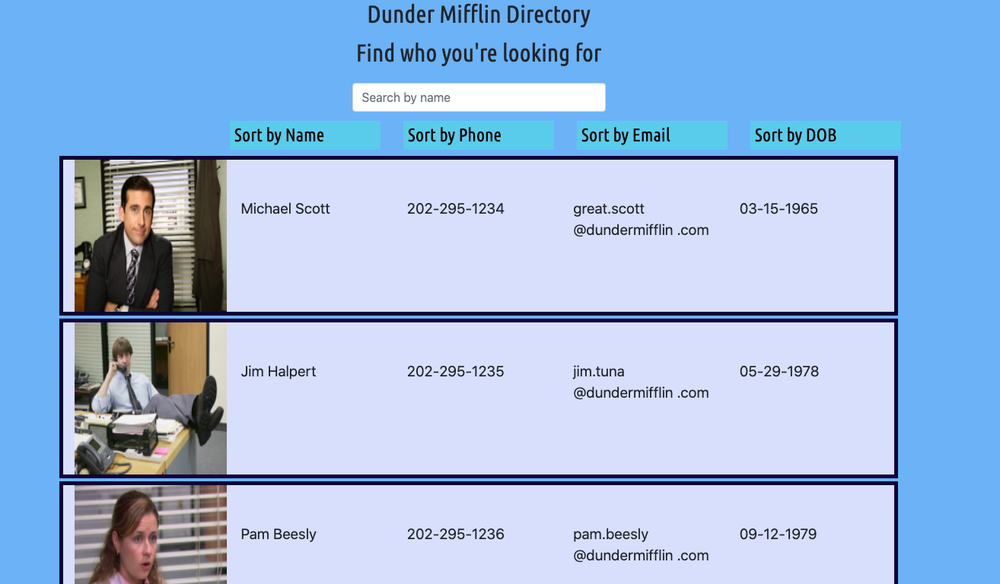

# **Employee Directory**

This super fun and functional app allows peeps to view my entire employee directory at once so that I have quick access to their information.

## Table of contents

- [Description](#Description)
- [Installation](#Installation)
- [Usage](#Usage)
- [Link](#Links) 
- [Licenses](#Licenses)
- [Contributors](#Contributors)
- [Test](#Test)
- [GitHub Info](#GitHub) 

## Description
         This app uses React! Yes, this is the future.

## Installation

        npm install 

## Usage

        AS A Regional Manager
        I WANT to see all my employee's information
        SO THAT I can contact them faster

## Link

- [Deployed App in Heroku](https://rocky-shelf-34716.herokuapp.com/)

## Licenses

## Contributors

## Test

Tests: done and pass with flying colors.

## GitHub

- [GitHub Profile](https://github.com/paulinalo22)